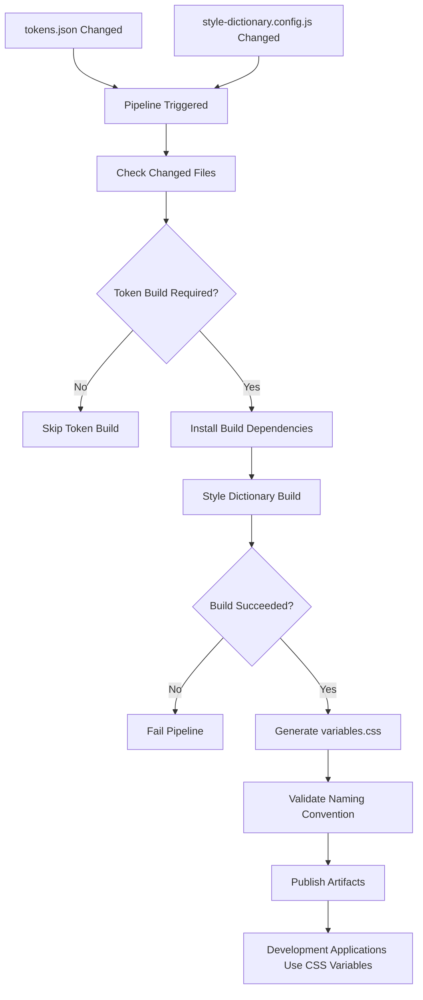

# CI/CD Flow

This diagram shows the repository pipeline that reacts to token changes, runs Style Dictionary, generates `variables.css`, and publishes the build artifact for development applications.

