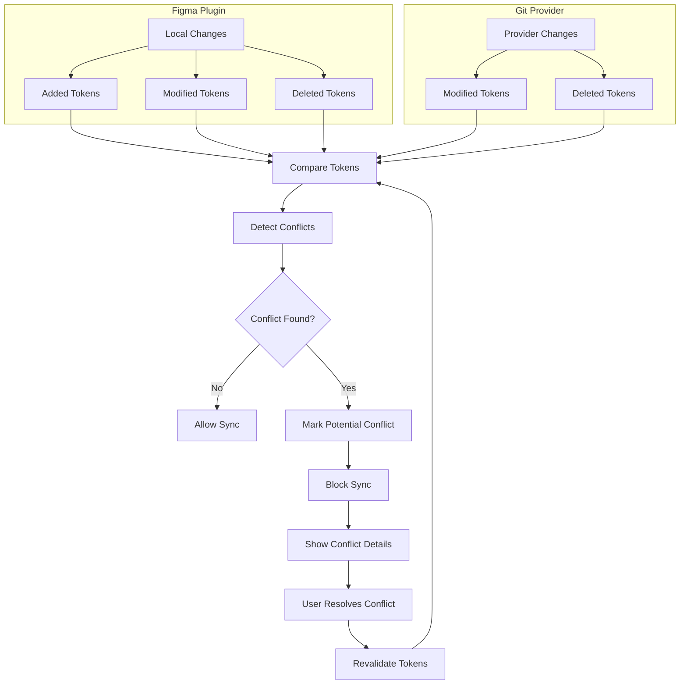

# Conflict Resolution Flow

This diagram shows how local token edits and provider token changes are compared, how conflicts are detected, and how unresolved conflicts block sync until the user resolves them.

