# Design Token Automation Full Flow

This Cowart-compatible Mermaid flowchart describes the complete Design Token Automation lifecycle: plugin startup sync, Add/Edit Token dialog validation, sync preview, provider sync, Merge Request handling, conflict handling, repository storage, CI/CD processing, Style Dictionary output, and developer usage.

```mermaid
flowchart TD
  Start["Open Figma Plugin"]

  subgraph PluginStartup["Plugin Startup Sync"]
    LoadConfig["Load Provider Configuration"]
    ProviderConfigured{"Provider Configured?"}
    UseLocalOnly["Use Local Token State"]
    CheckProvider["Check Provider Connection"]
    ProviderValid{"Connection Valid?"}
    FetchTokens["Fetch Latest tokens.json"]
    FetchOk{"tokens.json Found?"}
    LocalChanges{"Local Changes Exist?"}
    UpdateFromProvider["Update Plugin Tokens from Provider"]
    CompareStartup["Compare Local Changes with Provider Version"]
    UpdateStartupSync["Update Sync Section with Diff"]
    StartupConflict{"Potential Conflict?"}
    StartupBlockSync["Block Sync and Warn User"]
    StartupEnableSync["Sync Section Ready"]
  end

  subgraph TokenManagement["Token Management and Validation"]
    CreateOrEdit["Open Add/Edit Token Dialog"]
    Validate["Validate Before Save"]
    ValidateName["Check Name Required and Unique in Set"]
    ValidateValue["Check Value Matches Token Type"]
    ValidateRefs["Check References, Circular Links, and Theme Resolution"]
    ValidateDelete["Check Referenced Tokens Are Not Deleted"]
    ValidationPassed{"Validation Passed?"}
    ShowValidationError["Show Inline Validation Error"]
    BlockInvalidSave["Do Not Save Invalid Token to Plugin State"]
    SaveLocal["Save Local Changes"]
  end

  subgraph SyncPreview["Sync Preview"]
    BuildDiff["Build Diff"]
    ShowAdded["Show Added Tokens"]
    ShowModified["Show Modified Tokens with Old and New Values"]
    ShowDeleted["Show Deleted Tokens"]
    ShowSet["Show Token Set"]
    PreviewConflict{"Conflict in Preview?"}
    PreviewBlock["Block Sync Until Resolved"]
    CheckSyncConditions["Check Sync Enable Conditions: No Token Errors, No Theme Reference Errors, No Conflicts"]
    EnableSyncButton["Enable Sync Button"]
  end

  subgraph ProviderSync["Provider Sync"]
    UserSync["User Clicks Sync"]
    Preflight["Run Sync Preflight"]
    CheckValidationState["Check Token and Theme Validation State"]
    TestConnection["Test Connection"]
    CheckChanges["Check tokens.json Has Changes"]
    CheckTargetConflict["Check Target Branch Conflicts"]
    PreflightOk{"Preflight Passed?"}
    StopSync["Stop Sync and Show Error"]
    CheckPendingMr["Check Pending Merge Request"]
  end

  subgraph MergeRequestHandling["Merge Request Handling"]
    OpenMr{"Open MR Exists?"}
    CreateBranch["Create New Branch"]
    CommitNew["Commit tokens.json Changes"]
    CreateMr["Create Merge Request"]
    RebaseBranch["Rebase Existing MR Branch"]
    RebaseOk{"Rebase Successful?"}
    CommitExisting["Commit New Sync Changes"]
    UpdateMr["Update Existing Merge Request"]
    MrReady["Merge Request Ready for Review"]
  end

  subgraph ConflictHandling["Conflict Handling"]
    ConflictDetected["Detect Conflict"]
    MarkConflict["Mark Potential Conflict"]
    BlockProviderSync["Block Provider Sync"]
    ShowConflictDetails["Show Conflict Details"]
    UserResolves["User Resolves Conflict"]
    RevalidateAfterResolve["Revalidate and Rebuild Diff"]
  end

  subgraph GitProvider["Git Provider: GitHub or GitLab"]
    ProviderApi["Provider API"]
    ReviewMerge["Review and Merge MR"]
  end

  subgraph Repository["Repository"]
    TokensJson["tokens.json"]
    StyleDictionaryConfig["style-dictionary.config.js"]
    BuildFolder["build/"]
    VariablesCss["build/variables.css"]
  end

  subgraph CICD["CI/CD Pipeline"]
    PipelineTriggered["Pipeline Triggered by tokens.json or Config Change"]
    InstallBuildDeps["Install Build Dependencies"]
    StyleDictionaryBuild["Run Style Dictionary Build"]
    BuildPassed{"Build Passed?"}
    FailPipeline["Fail Pipeline"]
    GenerateCssVars["Generate CSS Variables"]
    PublishArtifacts["Publish Artifacts"]
  end

  subgraph DeveloperUsage["Developer Usage"]
    ConsumeCss["Import variables.css"]
    UseVariables["Use CSS Variables in Applications"]
    Apps["Development Applications"]
  end

  Start --> LoadConfig
  LoadConfig --> ProviderConfigured
  ProviderConfigured -- No --> UseLocalOnly
  UseLocalOnly --> CreateOrEdit
  ProviderConfigured -- Yes --> CheckProvider
  CheckProvider --> ProviderValid
  ProviderValid -- No --> UseLocalOnly
  ProviderValid -- Yes --> FetchTokens
  FetchTokens --> FetchOk
  FetchOk -- No --> UseLocalOnly
  FetchOk -- Yes --> LocalChanges
  LocalChanges -- No --> UpdateFromProvider
  UpdateFromProvider --> StartupEnableSync
  LocalChanges -- Yes --> CompareStartup
  CompareStartup --> UpdateStartupSync
  UpdateStartupSync --> StartupConflict
  StartupConflict -- Yes --> StartupBlockSync
  StartupBlockSync --> ConflictDetected
  StartupConflict -- No --> StartupEnableSync
  StartupEnableSync --> CreateOrEdit

  CreateOrEdit --> Validate
  Validate --> ValidateName
  ValidateName --> ValidateValue
  ValidateValue --> ValidateRefs
  ValidateRefs --> ValidateDelete
  ValidateDelete --> ValidationPassed
  ValidationPassed -- No --> ShowValidationError
  ShowValidationError --> BlockInvalidSave
  BlockInvalidSave --> CreateOrEdit
  ValidationPassed -- Yes --> SaveLocal

  SaveLocal --> BuildDiff
  BuildDiff --> ShowAdded
  BuildDiff --> ShowModified
  BuildDiff --> ShowDeleted
  BuildDiff --> ShowSet
  ShowAdded --> PreviewConflict
  ShowModified --> PreviewConflict
  ShowDeleted --> PreviewConflict
  ShowSet --> PreviewConflict
  PreviewConflict -- Yes --> PreviewBlock
  PreviewBlock --> ConflictDetected
  PreviewConflict -- No --> CheckSyncConditions
  CheckSyncConditions --> EnableSyncButton

  ConflictDetected --> MarkConflict
  MarkConflict --> BlockProviderSync
  BlockProviderSync --> ShowConflictDetails
  ShowConflictDetails --> UserResolves
  UserResolves --> RevalidateAfterResolve
  RevalidateAfterResolve --> Validate

  EnableSyncButton --> UserSync
  UserSync --> Preflight
  Preflight --> CheckValidationState
  Preflight --> TestConnection
  Preflight --> CheckChanges
  Preflight --> CheckTargetConflict
  CheckValidationState --> PreflightOk
  TestConnection --> PreflightOk
  CheckChanges --> PreflightOk
  CheckTargetConflict --> PreflightOk
  PreflightOk -- No --> StopSync
  PreflightOk -- Yes --> CheckPendingMr

  CheckPendingMr --> ProviderApi
  ProviderApi --> OpenMr
  OpenMr -- No --> CreateBranch
  CreateBranch --> CommitNew
  CommitNew --> CreateMr
  CreateMr --> MrReady
  OpenMr -- Yes --> RebaseBranch
  RebaseBranch --> RebaseOk
  RebaseOk -- No --> ConflictDetected
  RebaseOk -- Yes --> CommitExisting
  CommitExisting --> UpdateMr
  UpdateMr --> MrReady

  MrReady --> ReviewMerge
  ReviewMerge --> TokensJson
  TokensJson --> PipelineTriggered
  StyleDictionaryConfig --> PipelineTriggered
  PipelineTriggered --> InstallBuildDeps
  InstallBuildDeps --> StyleDictionaryBuild
  StyleDictionaryBuild --> BuildPassed
  BuildPassed -- No --> FailPipeline
  BuildPassed -- Yes --> GenerateCssVars
  GenerateCssVars --> VariablesCss
  VariablesCss --> BuildFolder
  VariablesCss --> PublishArtifacts
  PublishArtifacts --> ConsumeCss
  ConsumeCss --> UseVariables
  UseVariables --> Apps
```

