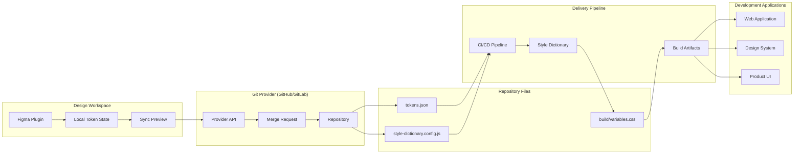

# High-level System Architecture

This diagram shows how the Figma Plugin acts as the token management source, while the repository and CI/CD pipeline store, review, build, and distribute generated token outputs.

