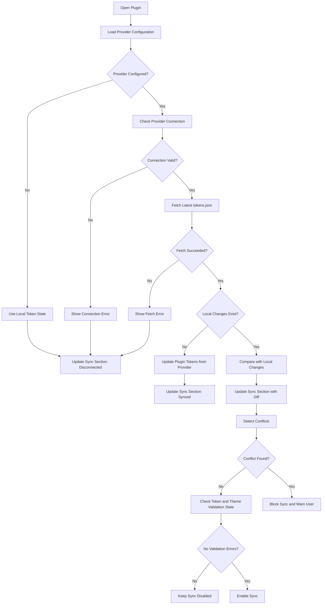

# Plugin Startup Flow

This diagram shows how the plugin initializes provider-backed token data, compares provider state with local changes, updates the Sync section, and detects conflicts before sync.

