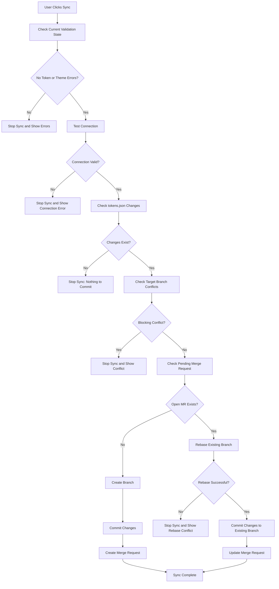

# Sync Flow

This diagram describes the provider sync path, including validation state checks, theme reference checks, connection testing, pending Merge Request reuse, branch creation, rebase, commit, and Merge Request update.

