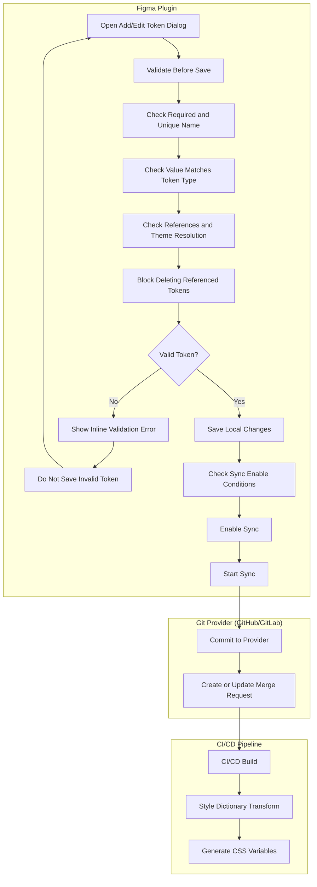

# Token Lifecycle Flow

This diagram follows a token from the Add/Edit Token dialog through inline validation, local save, provider sync, review, CI/CD build, and generated CSS Variables.

```mermaid
flowchart TD
  subgraph Plugin["Figma Plugin"]
    CreateToken["Open Add/Edit Token Dialog"]
    ValidateToken["Validate Before Save"]
    ValidateName["Check Required and Unique Name"]
    ValidateValue["Check Value Matches Token Type"]
    ValidateReferences["Check References and Theme Resolution"]
    ValidateDelete["Block Deleting Referenced Tokens"]
    ValidationPassed{"Valid Token?"}
    ShowValidationError["Show Inline Validation Error"]
    BlockSave["Do Not Save Invalid Token"]
    SaveLocalChanges["Save Local Changes"]
    CheckSyncReady["Check Sync Enable Conditions"]
    EnableSync["Enable Sync"]
    SyncRequest["Start Sync"]
  end

  subgraph Provider["Git Provider (GitHub/GitLab)"]
    CommitProvider["Commit to Provider"]
    MergeRequest["Create or Update Merge Request"]
  end

  subgraph Pipeline["CI/CD Pipeline"]
    BuildStarted["CI/CD Build"]
    StyleDictionary["Style Dictionary Transform"]
    GenerateCss["Generate CSS Variables"]
  end

  CreateToken --> ValidateToken
  ValidateToken --> ValidateName
  ValidateName --> ValidateValue
  ValidateValue --> ValidateReferences
  ValidateReferences --> ValidateDelete
  ValidateDelete --> ValidationPassed
  ValidationPassed -- No --> ShowValidationError
  ShowValidationError --> BlockSave
  BlockSave --> CreateToken
  ValidationPassed -- Yes --> SaveLocalChanges
  SaveLocalChanges --> CheckSyncReady
  CheckSyncReady --> EnableSync
  EnableSync --> SyncRequest
  SyncRequest --> CommitProvider
  CommitProvider --> MergeRequest
  MergeRequest --> BuildStarted
  BuildStarted --> StyleDictionary
  StyleDictionary --> GenerateCss
```
